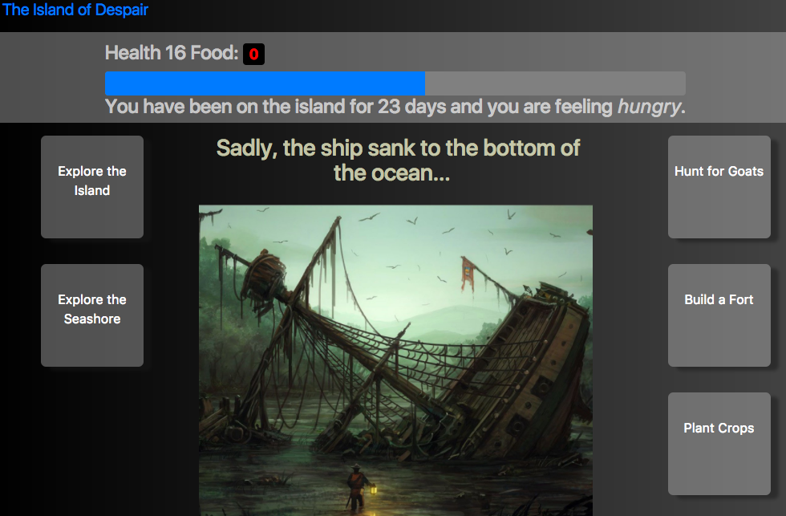

# The Island of Despair

A fast-paced survival game based on the plot of Daniel Defoe's Robinson Crusoe.

The Island of Despair can be used by teachers to engage students in Defoe's novel or it can be played for fun.

* Manage resources such as food, gold, and lumber to survive.
* Keep track of your highest score with browser-based local storage.
* Uses game-based pedagogy to complement reading Defoe's novel.

> [Demo Here](http://ndpeterson-island-of-despair.surge.sh/)

## Installation

Clone this repository and then open `index.html` in a browser.
